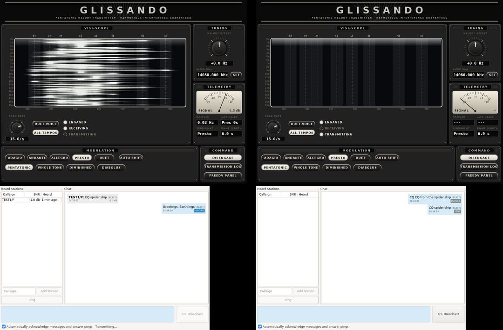

# Glissando console

Glissando is a weak-signal HF data mode built from melodic chirps: every
symbol glides from one note of a scale to the next, so a transmission is a
tune. The mode is designed in
[baitisj/glissando](https://github.com/baitisj/glissando) (`docs/DESIGN.md`,
NumPy prototype in `prototype/`). This fork carries a C++ port of that modem
and a front end for it.

## Two floating windows

* **The console** (`Tools -> Glissando Console...`, or start FreeDV with
  `--glissando`). The visi-scope waterfall, tuning, and the mode's
  modulation options, dressed as Chaotica's control room from the Captain
  Proton holonovel.
* **The chat window** (`Transmission log` on the console, or
  `Tools -> Text Chat...`). The existing text chat UI, unchanged, in its own
  window.

While the console is open, text chat goes out as Glissando instead of over
the codec2 DATAC13/DATAC4 modes. Closing the console puts chat back on
codec2. With `--glissando` the console stands in for FreeDV's main window,
which is hidden (the `FreeDV panel` button brings it back for audio and rig
setup), and closing the console quits.

## Controls

| Control | What it does |
| --- | --- |
| Visi-scope | Receive spectrum over the melody's part of the passband, white phosphor on black. The scale's notes are ruled across it with the receiver's +/-25 Hz search band shaded. Double click to put the lowest note where you clicked; mouse wheel nudges the tuning 1 Hz (shift: 0.1 Hz). |
| Scan rate | Waterfall rows per second, 0.5 to 20. |
| Duet voice | Widens the scope to show the duet gear's high voice (C6..E7). |
| All tempos | Decode every gear at once, so a station that shifts gear is still heard. Off: only the chosen gear (and the one automatic shifting picked). |
| Melody offset | Moves every note by up to +/-250 Hz, on transmit and receive: the audio equivalent of the tuning dial. |
| Radio dial | Shows and sets the rig frequency through FreeDV's own frequency box, so rig control and the US data segment check follow it. |
| Tempo | Adagio (640 ms notes, 55 s frame), Andante, Allegro, Presto (80 ms, 7 s), Duet (two voices, two payloads per frame). |
| Auto shift | Picks the fastest gear the SNR and Doppler spread measured on the last frame heard support (`recommendGear`, the prototype's table with 2 dB margin). The hand-picked tempo stays lit and is used until something is heard, and again 15 minutes after the last frame. |
| Scale | Pentatonic (default, harmonious when stations overlap), whole tone, diminished, diabolus (tritones). The scale costs nothing in sensitivity (DESIGN.md 3.1a). |
| Telemetry | SNR meter, Doppler spread, tempo of the last frame and how long ago, tempo we would send at, and that tempo's frame length. |
| Engage | Starts and stops audio, as the main window's Start button does. |

Settings live in the FreeDV config under `[Glissando]`.

## How chat rides on Glissando

A Glissando frame carries 77 bits. `src/glissando/GlissandoLink.h` cuts each
chat burst (a 14 byte signalling frame or a 54 byte text frame) into 9 byte
segments with a 5 bit header (mode, index, last), dropping trailing zero
padding, so a short message costs fewer frames. The duet gear carries two
segments per frame. The receiver puts segments back together in order; a
missing segment loses the burst and the chat protocol retries it, as it does
a faded codec2 burst.

A Glissando burst takes tens of seconds, so the protocol's timers
(acknowledgement timeout, reservation for fragments still to come, reply
window) are no longer constants: `TextMessaging::AirTiming` holds them, the
codec2 defaults are unchanged, and `AirTiming::forFrameSeconds()` sizes them
to the tempo being sent. Carrier sense only sees a Glissando burst once its
first frame decodes, so the waits for the far end are sized to whole bursts.

Air time for a short message (up to 12 characters of text behind the 15 byte
header, three segments):
about 20 s at Presto, 41 s at Allegro, 2.8 minutes at Adagio. A full 54 byte
text fragment is six frames. Watch the transmit time-out timer at slow tempos.

## Modem

`src/glissando/` is a C++17 port of `prototype/glissando.py` and `fec.py`
with no wxWidgets or codec2 dependency: modulator, batch receiver (sync
search by dechirping, sample-accurate time refinement, BCJR over the note
trellis, K=7 r=1/2 Viterbi, CRC-14) and a streaming receiver that searches
each gear every quarter frame on a worker thread. It builds and tests on its
own:

    cmake -S src/glissando -B build-glissando -DUNITTEST=ON
    cmake --build build-glissando && ctest --test-dir build-glissando

The tests check modulation and FEC against vectors generated by the Python
prototype (`src/glissando/test/make_vectors.py`) and decode across gears,
scales and tuning offsets in noise.

## Two station bench

The text chat loopback bench runs Glissando too:

    FREEDV_TEST_MODE=4 FREEDV_EXTRA_ARGS=--glissando test/test_text_chat_loopback.sh up

Press Engage in both consoles, open both Transmission logs and send.

## Packaging

The fork's existing AppImage path (`appimage/make-appimage.sh`, built in
CI by `cmake-linux.yml`) already carries the console, since it is part of
the `freedv` binary. A Glissando-first AppImage needs only a desktop entry
that runs `freedv --glissando` and an icon.
